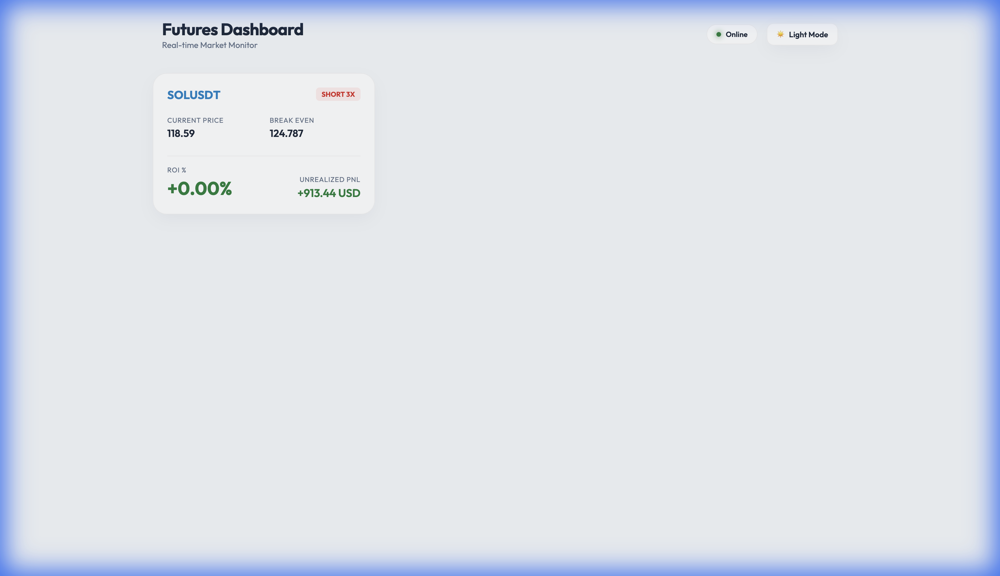

# CoinEx Futures Dashboard 🚀

A premium, real-time dashboard for monitoring CoinEx futures positions with surgical UI updates and accurate live pricing.



## Features
- **Accurate Pricing**: Fetches live ticker data directly from CoinEx via a secure proxy.
- **Real-time ROI**: Calculates ROI manually for maximum responsiveness.
- **Anti-Flicker**: Uses surgical DOM updates to ensure a smooth, premium experience.
- **Dark/Light Mode**: Sleek glassmorphism design with theme support.
- **Secure**: Sensitive API keys are stored in environment variables and never exposed to the frontend.

## Prerequisites
- [Node.js](https://nodejs.org/) installed on your machine.
- CoinEx API v2 Access ID and Secret Key.

## Setup Instructions

1. **Clone the repository** (or copy the files into a new folder).
2. **Install dependencies**:
   ```bash
   npm install
   ```
3. **Configure Environment Variables**:
   Create a `.env` file in the root directory (this is ignored by Git):
   ```env
   ACCESS_ID=your_access_id_here
   SECRET_KEY=your_secret_key_here
   PORT=3000
   ```
4. **Run the Dashboard**:
   ```bash
   node server.js
   ```
5. **Open in Browser**:
   Navigate to `http://localhost:3000`

## File Structure
- `index.html`: The premium frontend dashboard.
- `server.js`: Node.js proxy and static file server (handles secure signing).
- `.env`: (Local only) Your secret API credentials.
- `.gitignore`: Prevents sensitive files from being pushed to GitHub.

## License
MIT
